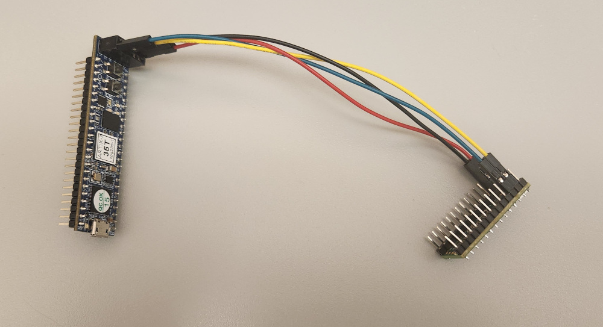
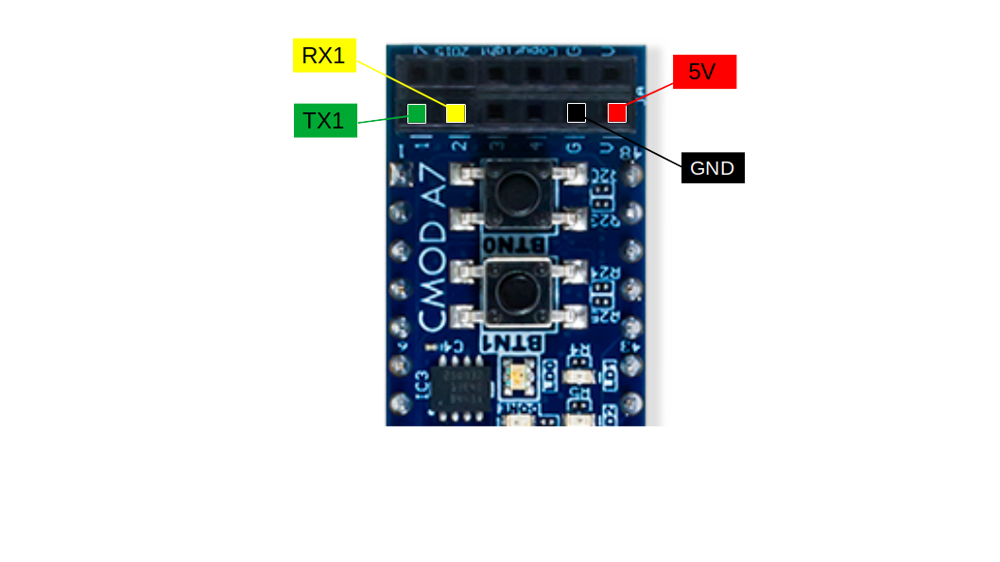

# Microcontroller / C++ support for TeNNLab FPGA



Point of Contact: [Simon D. Levy](https://github.com/simondlevy)

This directory contains support code for communicating between a microcontroller (MCU)
like Arduino and an FPGA programmed as described in the top-level
[README](../README.md), as well as support for those who wish to use C++
instead of Python for writing such programs on an ordinary Linux host computer. 

## Supported FPGAs

Currently the
[Xlilinx Cmod A7-35T FPGA](https://digilent.com/shop/cmod-a7-35t-breadboardable-artix-7-fpga-module/),
is the only FPGA supported.  

## Supported MCUs

The only Arduino-compatible MCUs I am aware of that support the 4MB baud rate that I'm using on the
Cmod FPGA are the [Teensy](https://www.pjrc.com/teensy/) boards from PJRC, and
the [ESP32](https://www.espressif.com/en/products/socs/esp32) line from Espressif Systems,
of which there are many development boards available.  If you get an example working on
another MCU, please commit it and do a pull request.

## Installation

1. Follow the directions in the [Getting Started](../README.md#getting_started)
section of the main repo README for installing the FPGA Python library. 

2. Install [openFPGALoader](https://trabucayre.github.io/openFPGALoader/guide/install.html)

3. Once you've set up the main repo, activated the Python environment and
connected the board to your host computer, try one of the following examples:

## POSIX XOR example

As you already need a POSIX environment for the main repo, it's probably easiest to start here,
before you attempt to run on Arduino or another MCU.  Run the following commands
from wherever you installed the main repo:

```bash
rm -rf ~/.cache/neuro_fpga # optional but recommended
python3 tennlab_fpga/utils/load.py -t cmoda7_35t networks/xor.txt # may take several minutes
cd tennlab_fpga/posix
make run
```
If everything goes well you should see this output at the end:

```
input = 0,0; output = 0
input = 0,1; output = 1
input = 1,0; output = 1
input = 1,1; output = 0
```

## Arduino XOR example


1. Wire your Arduino-compatible MCU to the PMOD pins on the Cmod as shown in the 
image above:

* Arduino 5V to PMOD V
* Arduino GND to PMOD G
* Arduino TX1 to PMOD G17
* Arduino RX1 to PMOD G19

2. Run the following commands from wherever you installed the main repo:

```bash
rm -rf ~/.cache/neuro_fpga # optional but recommended
python3 tennlab_fpga/utils/load.py -s -t cmoda7_35t_pmod networks/xor.txt # may take several minutes
cp -r tennlab_fpga $(HOME)/Arduino/libraries # or wherever you keep your Arduino libraries
```

3. Open the Arduino IDE, find the <b>TeNLabFPGA/Xor</b> example sketch in
the <b>File/Examples</b> menu for your board, and compile and flash the sketch
in the usual way.  If everything goes well you should see this output over and
over in the Serial Monitor:

```
input = 0,0; output = 0
input = 0,1; output = 1
input = 1,0; output = 1
input = 1,1; output = 0
```

## How it works

The [src](src/) directory contains a header-only C++ [Processor](src/processor.hpp)
class that provides equivalent functionality to the Python [Processor](../fpga/_processor.py)
class in the main part of the repository, with the exception that the C++ code
cannot load a network onto the FPGA.  The Processor class virtualizes the UART methods
to be used by the board (make connection, read, write, get number of bytes available),
which are implemented in the ```uart.cpp``` code in each of the examples.

The [utils/load.py](load.py) script uses the Python ```Processor``` class to support
loading a JSON-formatted network onto the FPGA in both volatile mode (already
supported in the [original repo](https://github.com/TENNLab-UTK/fpga)), and
non-volatile mode, the latter using the SPI flash on the Cmod FPGA.

## Exploring further

The [utils/mkdir.py](utils/mkhdr.py) script allows you to auto-generate a
declaration header instnatiating the ```Processor``` class based on the
JSON-specified number of inputs and outputs, charge width, and spike value
factor.  You can try this out for the XOR network by doing:

```bash
python3 tennlab_fpga/utils/mkhdr.py networks/xor.txt
```
